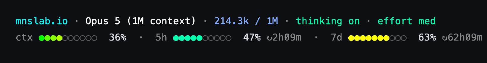

# claude_settings

A two-row status line for Claude Code, plus an Ansible playbook that pushes my
whole `~/.claude/` setup to every machine I run Claude Code on.



**Row 1** — folder · model · tokens used / context window · thinking on/off · effort level
**Row 2** — `ctx` context meter · `5h` and `7d` rate-limit meters, each with its reset countdown

Two things make the meters more useful than a plain percentage:

- **The `ctx` meter is scaled to a self-imposed 600k-token working budget**, not the
  model's full context window. On a 1M-context model you're deep red long before
  Claude starts compacting — which is the point: it's a nudge to wrap up or start
  a fresh session while the context is still sharp. Change `CTX_BUDGET_TOKENS`
  in the script to taste.
- **The `5h` / `7d` meters are colored by projected overshoot, not raw usage.**
  The script takes your burn rate so far in the window, projects it out to the
  reset time, and compares that against your remaining headroom. Green means
  you'll coast to the reset; yellow means it's close; red means you're on track
  to hit the cap early. 63% five hours into a week is fine — 63% five hours into
  a *day* is not, and the color reflects that.

## Install

`statusline.py` is pure Python 3 stdlib — no `jq`, no `bash`, no pip installs.
Works on macOS and Linux.

The lazy way — paste this into Claude Code:

```
update your statusline using this script:
https://raw.githubusercontent.com/cyburdine/claude_settings/refs/heads/main/statusline.py
```

Or do it yourself:

```bash
curl -fsSL https://raw.githubusercontent.com/cyburdine/claude_settings/refs/heads/main/statusline.py \
  -o ~/.claude/statusline.py
chmod +x ~/.claude/statusline.py
```

then merge this into `~/.claude/settings.json` (keep whatever else is already in
the file):

```json
{
  "statusLine": {
    "type": "command",
    "command": "~/.claude/statusline.py",
    "padding": 0,
    "refreshInterval": 60
  }
}
```

Restart Claude Code if the status line doesn't appear on its own — on a few
systems it only picks it up on a fresh start.

### Check it without launching Claude

The script reads one JSON blob on stdin, so you can preview it directly:

```bash
echo '{"workspace":{"current_dir":"/tmp/demo"},"model":{"display_name":"Opus 5"},
"context_window":{"context_window_size":1000000,"total_input_tokens":214300},
"thinking":{"enabled":true},"effort":{"level":"medium"},
"rate_limits":{"five_hour":{"used_percentage":47,"resets_at":9999999999},
"seven_day":{"used_percentage":63,"resets_at":9999999999}}}' | ~/.claude/statusline.py
```

If a field is missing from the payload it's simply left out of the row, and any
unexpected error falls back to a minimal one-line status rather than breaking
your prompt.

### Tweakables

All near the top of `statusline.py`:

| Constant | What it does |
| --- | --- |
| `CTX_BUDGET_TOKENS` | Token budget the `ctx` meter is scaled to (default 600k). |
| `BAR_WIDTH` | Dots per meter (default 10). |
| `CTX_GRADIENT` | Per-dot green→red gradient for the `ctx` bar. |
| `FILLED_CH` / `EMPTY_CH` | Meter glyphs, if your font hates `●`/`○`. |
| `EFFORT_C`, `MODEL_C`, `TOKENS_C` | Per-field 256-color codes for row 1. |

> `statusline.sh` is the older single-row bash version, kept around for anyone
> who'd rather not have Python in the loop. It has no rate-limit meters.

If you end up adding some cool features, definitely reach out! I'd love to see
what others are doing with this.

---

## Deploying settings to every machine with Ansible (`ansible/`)

The status line above is one file. If you run Claude Code on more than one box
(say a Mac plus a few Linux servers), the `ansible/` folder pushes a whole set
of customizations to **every instance at once** — into `~/.claude/` on each host.

### What it installs

| Target (`~/.claude/`) | Source | Notes |
| --- | --- | --- |
| `CLAUDE.md` | `ansible/files/CLAUDE.md` | Personal user memory, read every session. |
| `rules/*.md` | `ansible/files/rules/` | Modular + path-scoped rules. |
| `statusline.py` | `statusline.py` (repo root) | Installed `0755`; playbook warns if the host has no `python3`. |
| `settings.json` | `ansible/group_vars/all.yml` (`managed_settings`) | **Merged**, not overwritten. |

`settings.json` covers the toolchain-agnostic pieces: the `$schema` line,
permission allow/ask/deny lists, sensitive-file read denies, bash sandboxing,
`effortLevel`, `autoUpdatesChannel`, `tui`, the `statusLine` block, and an
empty `attribution` block (drops the co-author byline). Deploying with Ansible
means you can skip the manual install above entirely — the playbook drops in
`statusline.py` and wires up `statusLine` on every host.

### How to use it

```bash
# 1. Install Ansible on the machine you'll run from (e.g. your Mac)
brew install ansible          # macOS
# sudo dnf install ansible     # Rocky / RHEL

cd ansible

# 2. Add your hosts. Edit inventory.ini and uncomment/fill in the
#    [rocky_servers] block with each server's host/IP and SSH user.
#    The "mac-local" host already targets the machine you run from (no SSH).

# 3. Preview the changes without writing anything
ansible-playbook playbook.yml --check --diff

# 4. Apply
ansible-playbook playbook.yml                  # all hosts
ansible-playbook playbook.yml --limit mac-local
ansible-playbook playbook.yml --limit rocky_servers
```

### Why it's safe to run on machines you've already configured

- **Non-destructive `settings.json`.** It reads any existing file, deep-merges
  the managed keys, and **unions** the permission lists — your existing keys and
  allow/deny entries are kept, not clobbered.
- **Backups.** Every file it changes is backed up first (a timestamped sibling).
- **Idempotent.** Re-running makes no changes once a host already matches.

Customize what gets deployed by editing `ansible/group_vars/all.yml`
(settings) and `ansible/files/` (memory + rules). Full details and caveats live
in [`ansible/README.md`](ansible/README.md).
